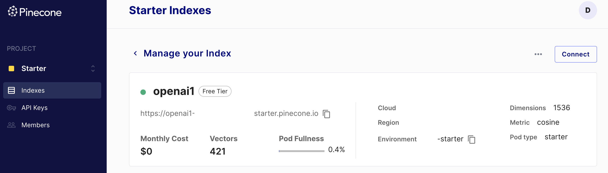

# Chat with Pinecone VectorDB

This repository demonstrates the integration of [Pinecone](https://www.pinecone.io/) - a cloud-native vector search service - with the LangChain application to enable scalable and efficient document retrieval. The primary aim is to showcase the benefits of using Pinecone as a vector database over the conventional in-memory vector database.

## Purpose

This app is designed to allow users to chat with documents by uploading PDFs, extracting content, embedding the content into vectors, and then querying based on user input. While the original implementation uses an in-memory vector database, this version is modified to use Pinecone, emphasizing the scalability and efficiency of cloud-native vector search solutions.

## Benefits of Pinecone over In-Memory VectorDB

1. **Scalability**: Pinecone is designed for large-scale vector search, making it suitable for applications with large datasets.
2. **Efficiency**: Pinecone provides faster search capabilities, especially when dealing with massive amounts of data.
3. **Cloud-Native**: Being a cloud-native solution, Pinecone offers easy integration, scalability, and maintenance.
4. **Managed Service**: No need to worry about infrastructure management, as Pinecone takes care of it.

## Acknowledgments

The original code for the LangChain application can be found at [LangChain's official Git repo](https://github.com/langchain-ai/streamlit-agent/blob/main/streamlit_agent/chat_with_documents.py). A huge shoutout to the developers behind LangChain for their fantastic work. This repository is primarily a demonstration of integrating Pinecone and not an endorsement or critique of the original implementation.

## Modifications

The main modifications from the original LangChain code include:

1. **Pinecone Initialization**: Integrated Pinecone and initialized it with the necessary API keys and environment variables.
2. **Embeddings**: Switched from HuggingFaceEmbeddings to OpenAIEmbeddings for document embeddings.
3. **Vectorstore Creation**: Replaced the in-memory vector database with Pinecone for storing and retrieving document embeddings.
4. **Retrieval**: Defined a retriever on the Pinecone vectorstore for efficient document retrieval based on user queries.

For a detailed comparison, refer to the main application code in this repository.

